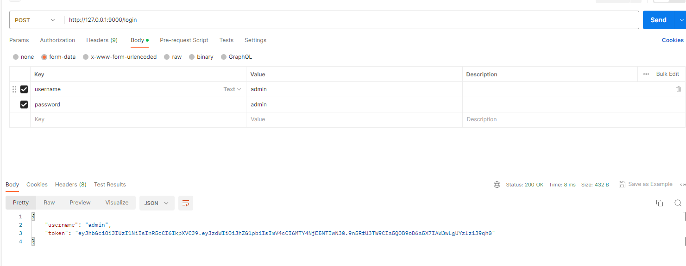
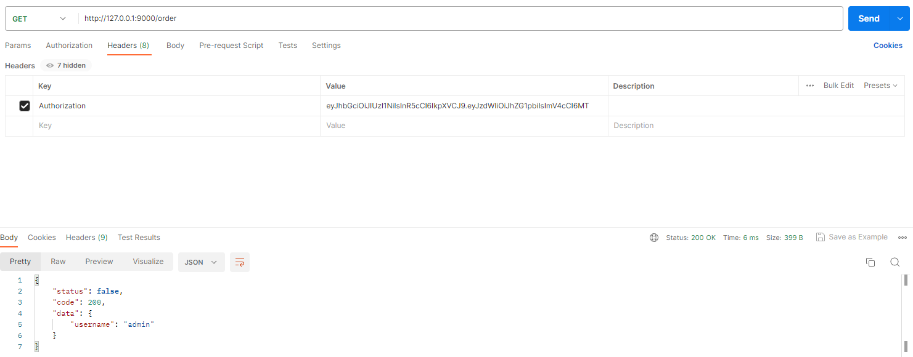

## tornado实现简单的接口认证机制

### 安装依赖
```bash
pip install pyjwt==2.6.0

pip install torando==6.3.1

pip install tornado-swagger
```

### swagger文档
运行`main.py`,然后访问:`http://127.0.0.1:9000/api/doc`.

### postman请求示例

#### 登录获取token



#### 获取相关信息
> 通过请求头传入`Authorization={token}`验证当前用户是否正常. 正常就通过.



### swagger

- https://swagger.io/specification/v2/
